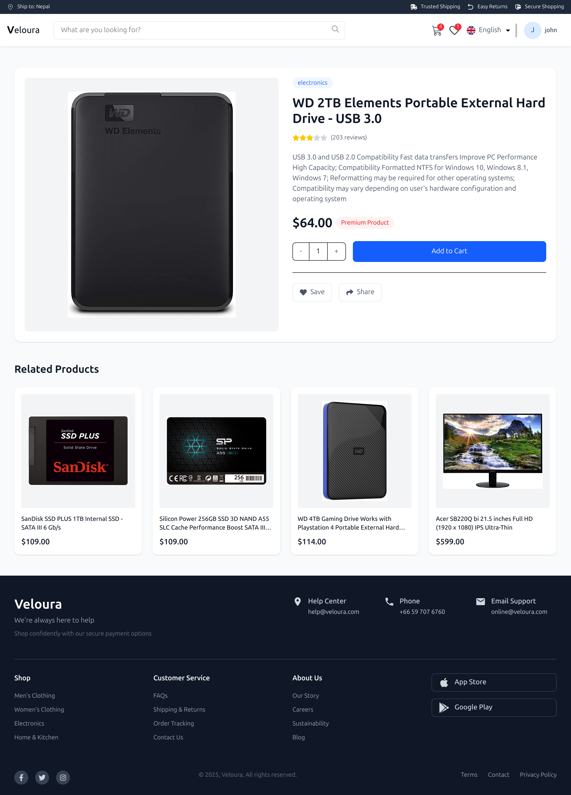
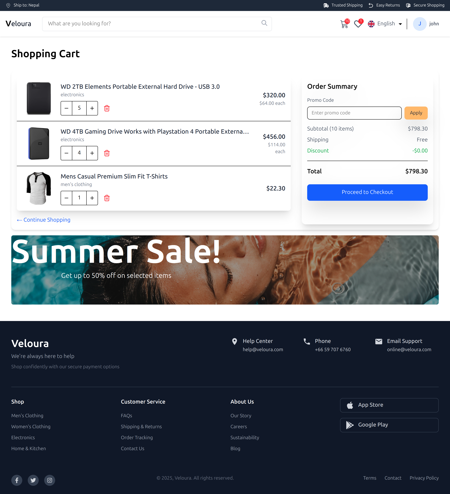

# Veloura - Modern E-commerce Platform

Veloura is a modern, responsive e-commerce platform built with React, offering a seamless shopping experience with a clean and intuitive user interface.


## 🛠️ Technology Stack

- **Frontend:** React.js, Vite
- **Styling:** TailwindCSS
- **State Management:** React Context
- **Routing:** React Router
- **API Integration:** Custom hooks with Fetch API
- **Authentication:** JWT-based auth system

## 📸 Screenshots

### Landing Page

*Modern and engaging landing page with hero section and featured products*

### Products Page

*Product catalog with filtering and search capabilities*

### Single Product Page

*Detailed product view with related items*

### Shopping Cart

*User-friendly shopping cart with quantity management*

## 🚀 Getting Started

1. Clone the repository:
   ```bash
   git clone <repository-url>
   cd veloura
   ```

2. Install dependencies:
   ```bash
   npm install
   ```

3. Start the development server:
   ```bash
   npm run dev
   ```

4. Open your browser and visit:
   ```
   http://localhost:5173
   ```

## 🗂️ Project Structure

```
src/
├── components/     # Reusable UI components
├── context/       # React Context providers
├── hooks/         # Custom React hooks
├── layouts/       # Layout components
├── pages/         # Page components
└── services/      # API services
```


## 🛠️ Development

- Run development server: `npm run dev`
- Build for production: `npm run build`
- Preview production build: `npm run preview`
- Lint code: `npm run lint`
